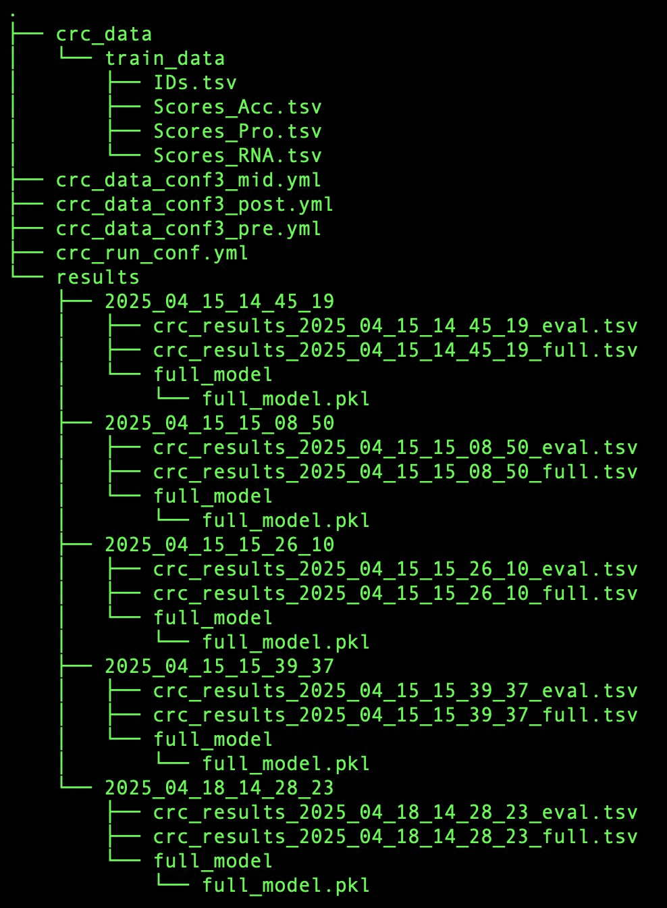
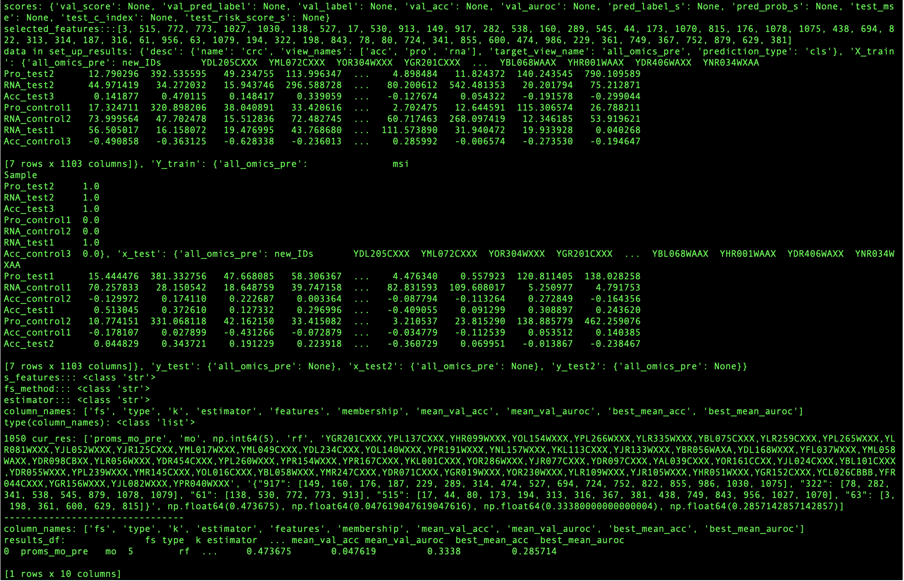

# ProMS3: protein marker selection using proteomics or multi-omics data with 3 algorithms

ProMS (*Pro*tein *M*arker *S*election) is a python package designed to tackle a novel problem of multiview
feature selection: given multiple views of same set of samples,
select important features from one view of interest (target view) by integrating
information from other views. It was initially developed to select protein
biomarkers using proteomics data with the help of additional omics views
(e.g. RNAseq).


ProMS3 was modified ProMS to switch three data integration strategies:

1, Late integration (post): The original ProMS algorithm, 
  which builds separate models for each omics view and combines the results based on selected features.

2, Mid integration (mid): During model construction,
  both test and control groups must include at least one replicate from each omics view.

3, Early (pre) integration: Omics data are integrated prior to model construction.


branch origin resources
[Check out the documentation](http://docs.zhang-lab.org/proms/)


## 💻 Installation and Run ProMS3
</code></pre>
```bash
# We recommend building a new conda environment
conda create -n proms3 python=3.11
conda activate proms3

# Install dependencies
conda install -c conda-forge ecos

# Install proms3 directly from GitHub
pip install git+https://github.com/ta-akb/proms3

# Confirm installation
which proms3
# This should show the path to the installed CLI if successful
# ex, /opt/homebrew/Caskroom/miniforge/base/envs/proms3/bin/proms3
```
</code></pre>

## 📁 Test File Setup
</code></pre>
```bash

Download the test files in raw format and place them in the following directory structure:

📂 Output directories and result files will be automatically generated with a timestamp when the run is completed.

```
</code></pre>




</code></pre>
```
# Example execution
proms3_train -f crc_run_conf.yml -d crc_data_conf3_pre.yml


### Survival mode and single omics mode are still developing ###
```
</code></pre>


## 📊 Example Output

Here is an example of the test file result on terminal with results directory creation:



The estimated time for calculation to complete with this test file is approximately a few minutes on a Mac M1 system.

Algorithms are able to be changed target_view in conf yml file.

Pre-integration → target_view: all_omics_pre  
Mid-integration → target_view: all_omics_mid  
Post-integration → target_view: all_omics_post  

Please refer to the sample data files and Shi's homepage for the data structure and settings.


## 📄 Reference

This package is part of an ongoing research project.  
The associated manuscript is currently being prepared for submission.


## 🛡 License

This project is a fork of [Zhiao Shi's original work](https://github.com/zhiao/proms),  
which is licensed under the [MIT License](LICENSE).

Modifications and extensions by Taiki Akiba (2025) are also released under the MIT License.


